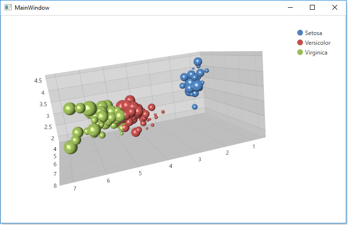

<!-- default badges list -->

<!-- default badges end -->

# Chart for WPF - Create a 3D Chart with Automatically Generated Series

This example shows how to design a 3D chart with automatically generated series based on an underlying data source.

## Files to Review

* [Iris.cs](./CS/Chart3D_Lesson3/Iris.cs) (VB: [IrisesViewModel.vb](./VB/Chart3D_Lesson3/IrisesViewModel.vb))
* [IrisesViewModel.cs](./CS/Chart3D_Lesson3/IrisesViewModel.cs) (VB: [IrisesViewModel.vb](./VB/Chart3D_Lesson3/IrisesViewModel.vb))
* **[MainWindow.xaml](./CS/Chart3D_Lesson3/MainWindow.xaml) (VB: [MainWindow.xaml](./VB/Chart3D_Lesson3/MainWindow.xaml))**

## Documentation 

[Lesson 3 - Create a 3D Chart with Automatically Generated Series](https://docs.devexpress.com/WPF/117718/controls-and-libraries/charts-suite/chart3d-control/getting-started/lesson-3-create-a-3d-chart-with-automatically-generated-series)

## More Examples

* [Chart for WPF - Create a Simple Unbound 3D Chart](https://github.com/DevExpress-Examples/wpf-pivot-create-unbound-3d-chart)
